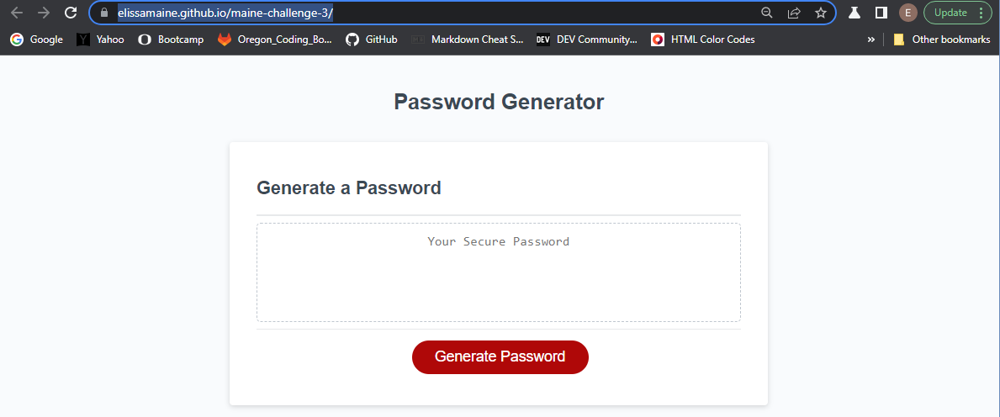
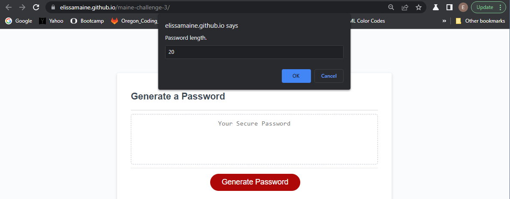
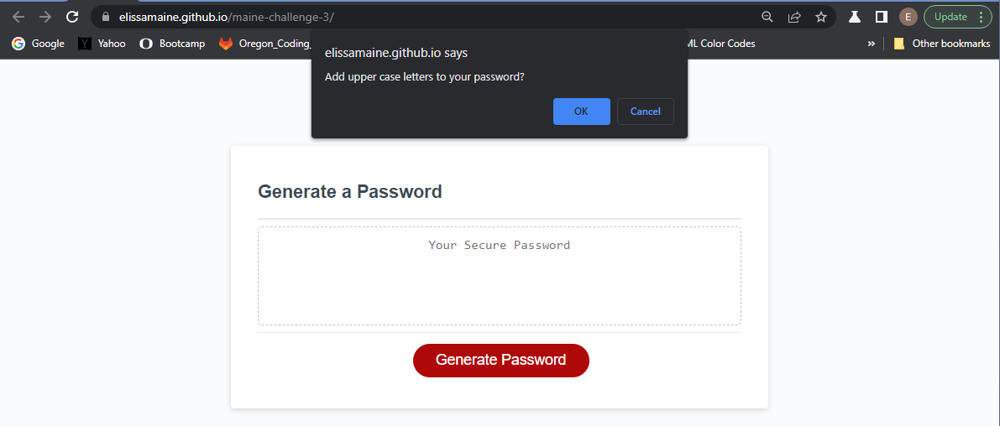
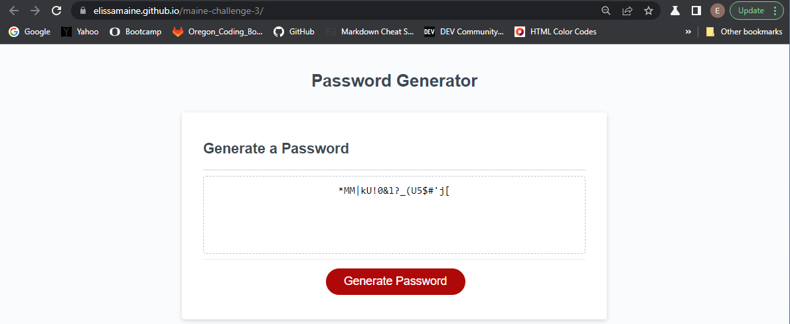

# Password Generator

## Description

This JavaScript password generator was created to maked a random password of the users desired length and with their desired characters. When the user clicks on the generate password button a prompt will apear asking the user to input their desired length between 8 and 128 characters, if the input is not in the range then they will get an alert saying the input wasnt in the given range. Then there will be 4 confirm windows asking for the user to confirm if they want either upper case, lower case, numbers, and special characters. if no characters are selected another alert will appear stating that at least one kind oc character has to be selected. after the user answers these questions a random password with thir selected characters and of theri chosen length will appear in the box on the site. 

## Screenshots

## Link to Deployed Application

[Deployed Website](https://elissamaine.github.io/maine-challenge-3/)